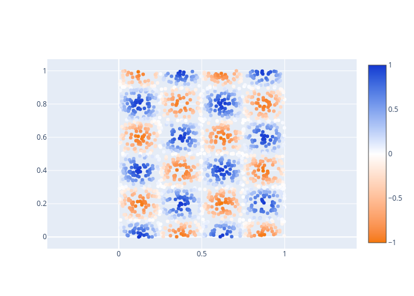

# Examples

- [Improving an existing Palette](#improving-an-existing-palette)
- [LaTeX-Export](#latex-export)
- [Automatic Color Names](#automatic-color-names)
- [Creating a Palette using a base color](#creating-a-palette-using-a-base-color)
- [Extending a Palette](#extending-a-palette)
- [Incremental Palette Creation](#incremental-palette-creation)
- [Gradient Interpolation](#gradient-interpolation)
- [Reshading an Image](#reshading-an-image)

## Improving an existing Palette

Loading the plotly default palette, adding black and white, modifying it for better visibility and displaying the original and the optimized version in the IPython shell as is and with different types of simulated colorblindnesses:

<details>
<summary>Code</summary>

```python
import ethcolor
from ethcolor import display_palette, simulate_colorblind, hue_sort
import numpy as np
palette = ethcolor.default_palettes.get_palette("plotly").ensure_black_and_white()
# Set change_weight to a low value as the number of colors and adding black and white sufficiently constrains the optimization
opt_palette = ethcolor.optimize_palette(palette, change_weight=.15)
print("No colorblindness")
display_palette(hue_sort(palette.get_color_values()))
display_palette(hue_sort(opt_palette.get_color_values()))
for cb,v in zip(["Protanopia","Deutranopia","Tritanopia"], np.eye(3)*.75):
	print(f"75% {cb}")
	display_palette(hue_sort([
		simulate_colorblind(c, *v)
		for c in palette.get_color_values()
	]))
	display_palette(hue_sort([
		simulate_colorblind(c, *v)
		for c in opt_palette.get_color_values()
	]))
```
</details>

<details>
<summary>Output</summary>

No colorblindness


75% Protanopia


75% Deutranopia


75% Tritanopia


</details><hr/>

## LaTeX-Export

Exporting a palette to LaTeX code:

<details>
<summary>Code</summary>

```python
import ethcolor
print(ethcolor.default_palettes.get_palette("cblind").to_latex("cb"))
```
</details>

<details>
<summary>Output</summary>

```latex
% Palette: cblind
\definecolor{cbblack}{RGB}{0,0,0}
\definecolor{cborange}{RGB}{251,162,0}
\definecolor{cbcyan}{RGB}{0,183,236}
\definecolor{cbgreen}{RGB}{0,161,119}
\definecolor{cbyellow}{RGB}{246,231,55}
\definecolor{cbblue}{RGB}{0,119,184}
\definecolor{cbvermillion}{RGB}{244,100,13}
\definecolor{cbpurple}{RGB}{228,126,173}
```
</details><hr/>

## Automatic Color Names

Creating a random color palette, automatically detect color names in snake case, adding the palette to the default palette manager, and printing Python code to define the palette in the future without running the optimization:

<details>
<summary>Code</summary>

```python
import ethcolor
import numpy as np
# Seeding of the numpy random generator for reproducible palette generation
np.random.seed(42)
# Setting `white=True` appends white during optimizing, such that all colors
# get pushed away from white.
colors = ethcolor.random_colors(8, white=True)
palette = ethcolor.colors_to_palette("random", colors, name_format=ethcolor.NAME_FORMATS.SNAKE)
ethcolor.default_palettes.add_palette(palette)
# Displaying the new palette
ethcolor.display_palette(ethcolor.default_palettes.get_palette("random"))
print(ethcolor.default_palettes.get_palette("random").to_python())
```
</details>

<details>
<summary>Output</summary>


```python
# Palette: random
palette = ethcolor.Palette("random", [
  ["caribbean_green", "RGB(0,255,153)"],
  ["gamboge", "RGB(238,145,0)"],
  ["observatory", "RGB(0,153,113)"],
  ["blue_diamond", "RGB(54,0,115)"],
  ["cardinal", "RGB(196,0,56)"],
  ["blue", "RGB(18,0,255)"],
  ["dull_lavender", "RGB(181,155,255)"],
  ["midnight_moss", "RGB(0,27,0)"],
])
```
</details><hr/>

## Creating a Palette using a base color

Creating a palette from a desired color, here `#d9bb26` and 7 other colors and masking the desired color to not change during optimization:

<details>
<summary>Code</summary>

```python
import ethcolor
import numpy as np
np.random.seed(1)
main_color = "#d9bb26"
# Starting colors are the main hex-format color and 7 random rgb-format colors
init_colors = [main_color, *np.random.sample((7,3))]
# A mask with False at the first index and True everywhere else
mask = np.arange(len(init_colors)) > 0
# Also optimize with fixed white and black for good contrast in both day- and night-mode
opt_colors = ethcolor.optimize_palette(
	init_colors,
	change_weight=.1,
	mask=list(mask),
	black=True,
	white=True,
)
# Ensure that the first color did not change
assert init_colors[0] == opt_colors[0].get_value(ethcolor.COLOR_FORMATS.HEX)
# Display the palettes sorted by hue values
ethcolor.display_palette(ethcolor.hue_sort(init_colors))
ethcolor.display_palette(ethcolor.hue_sort(opt_colors))
```
</details>

<details>
<summary>Output</summary>


</details><hr/>

## Extending a Palette

Extend an existing palette with additional colors optimized for visual diversity while keeping the original colors

<details>
<summary>Code</summary>

```python
import ethcolor
import numpy as np
np.random.seed(1)
start_colors = ["#df928e", "#f4b942", "#3c4f76"]
# Extend palette to 8 colors, also use black and white during optimization
# to have good contrast on white and black backgrounds
opt_colors = ethcolor.extend_colors(
	start_colors, 8,
	black=True, white=True,
)
# Ensure that the first three colors did not change
for i in range(len(start_colors)):
	assert start_colors[i] == opt_colors[i].get_value(ethcolor.COLOR_FORMATS.HEX)
# Display the palettes
ethcolor.display_palette(start_colors)
ethcolor.display_palette(opt_colors)
```
</details>

<details>
<summary>Output</summary>


</details><hr/>

## Incremental Palette Creation

Incrementally create a random palette, such that the first 4 colors are optimized for visual diversity and any additional color is most diverse from the already generated colors. I.e. the first 4 must be mutually diverse, the 5th is optimized to be different from the first 4, the 6th is different from the first 5 and so on.
This time, the optimization is only constrained to be different from white for use in prints.

<details>
<summary>Code</summary>

```python
import ethcolor
import numpy as np
np.random.seed(20)
# Generate 12 colors, where the first 4 are most diverse and
# every additional color differs from the previous ones.
rand_colors = ethcolor.random_incremental_colors(
	n_total=12, n_start=4, n_increment=1,
	white=True,
)
# Display the palettes
ethcolor.display_palette(rand_colors)
# Print generating python code
print(ethcolor.colors_to_palette("incremental", rand_colors).to_python())
```
</details>

<details>
<summary>Output</summary>


```python
# Palette: incremental
palette = ethcolor.Palette("incremental", [
  ["blue_lagoon", "RGB(0,115,131)"],
  ["guardsman_red", "RGB(190,0,3)"],
  ["carissma", "RGB(229,144,169)"],
  ["blue", "RGB(54,0,255)"],
  ["chartreuse", "RGB(119,198,0)"],
  ["medium_purple", "RGB(168,89,255)"],
  ["grape", "RGB(55,30,94)"],
  ["cyan_/_aqua", "RGB(0,219,255)"],
  ["buttered_rum", "RGB(169,125,0)"],
  ["celadon", "RGB(185,224,162)"],
  ["black", "RGB(0,1,0)"],
  ["west_coast", "RGB(99,80,16)"],
])
```
</details><hr/>

## Gradient Interpolation

Creating a color gradient and using it as a color scale in a plotly figure:

<details>
<summary>Code</summary>

```python
import ethcolor
import numpy as np
import plotly.graph_objects as go
# Define start, mid, and end color of the color scale
start_color = "RGB(245,120,  4)"
mid_color   = "RGB(255,255,255)"
end_color   = "RGB( 22, 56,209)"
# Get a high resolution interpolation in OKLAB space, rather than plotlys RGB interpolation
interpolated_colors = ethcolor.interpolate_color_series([start_color, mid_color, end_color], 200)
# Create the plotly colorscale
colorscale = ethcolor.create_plotly_scale(interpolated_colors)
# Create a basic scatter dataset
x,y = np.random.sample((2,2000))
z = np.sin(4*np.pi*x) * np.cos(5*np.pi*y)
# Make the plot
go.Figure(
	go.Scatter(
		x=x,
		y=y,
		mode="markers",
		marker_cmin=-1,
		marker_cmax=+1,
		marker_color=z,
		marker_colorscale=colorscale,
		marker_showscale=True,
	),
	layout_yaxis_scaleanchor="x",
).show()
```
</details>

<details>
<summary>Output</summary>


</details><hr/>

## Reshading an Image

Load an image and update its colors to be more diverse/differentiable.
Displays the palette before and after optimization.
The "before" and "after" image are then plotted side by side.
This example requires the additional python package `Pylette`.

<details>
<summary>Code</summary>

```python
import ethcolor
from scipy.interpolate import RBFInterpolator
import numpy as np
import Pylette
from PIL import Image
from tqdm.auto import tqdm
from IPython.display import display

# Image to load
img_file = "readme_assets/example5.1.png"
# Palette size to extract from the image
palette_size = 8

def vector_interpolation(x,y):
	interp = RBFInterpolator(x,y)
	return lambda c: ethcolor.convert_color(
		interp(
			ethcolor.Color(ethcolor.COLOR_FORMATS.RGB, c)
			.get_value(ethcolor.COLOR_FORMATS.OKLAB)[None]
		)[0],
		ethcolor.COLOR_FORMATS.OKLAB,
		ethcolor.COLOR_FORMATS.RGB,
	).get_value()

# Extract the "fundamental" color palette of the image with Pylette
palette1 = [
	ethcolor.convert_color(c.rgb)
	for c in Pylette.extract_colors(img_file, palette_size=palette_size).colors
]
# Display the palette before optimization
ethcolor.display_palette(palette1)
# Create an improved palette (high change_weight to not diverge from the original colors too much)
palette2 = ethcolor.optimize_palette(palette1, change_weight=.95, out_format=ethcolor.COLOR_FORMATS.rgba)
# Display the palette after optimization
ethcolor.display_palette(palette2)
# Extend the palettes before and after optimization
# with the corners of the RGB color cube to ensure
# that our interpolating projection does not extend
# beyond the viable color space.
boundary_colors = [
	ethcolor.convert_color(f"rgb({r},{g},{b})")
	for r in [0,1] for g in [0,1] for b in [0,1]
]
palette1 += boundary_colors
palette2 += boundary_colors
# Create an interpolation function between both palettes using scipy
color_map = vector_interpolation(
	np.array([c.get_value(ethcolor.COLOR_FORMATS.OKLAB) for c in palette1]),
	np.array([c.get_value(ethcolor.COLOR_FORMATS.OKLAB) for c in palette2]),
)
# Load the image with pillow and extract the RGB values
img = Image.open(img_file)
img_arr = np.array(img)
# Create a modified copy of the image using our interpolation function
# between the original and the optimized colors
new_img_arr = np.zeros_like(img_arr)
for x in tqdm(range(img_arr.shape[0])):
	for y in range(img_arr.shape[1]):
		new_img_arr[x,y] = color_map(img_arr[x,y])
new_img_arr = np.clip(new_img_arr, 0, 255)
# Display both images side by side in the IPython shell
display(Image.fromarray(np.concatenate([img_arr,new_img_arr],axis=1)))
```
</details>

<details>
<summary>Output</summary>


</details>

