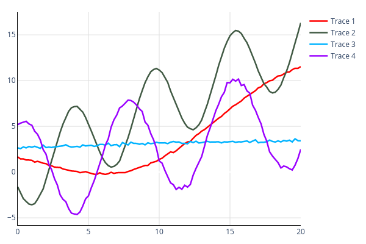
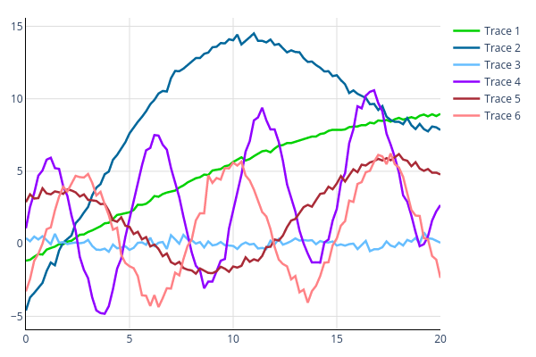
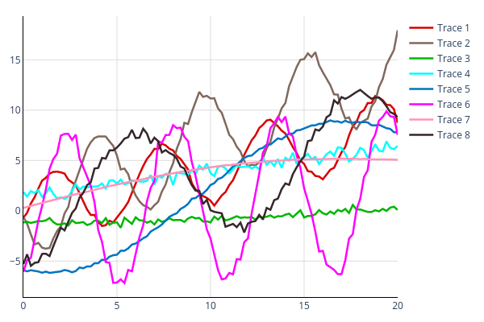
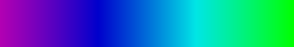

# ethcolor
A basic python package to generate, organize, expand, and optimize accessible color palettes.
This package is aimed at scientific plots, where the differentiability of colors is way more important than the "beauty" of a palette.
The main goal is thus, to have very distinguishable colors for colorblind and non-colorblind people, rather than a pretty combination of (often similar in tone) colors.

## Overview
- [Key Features](#key-features)
- [Examples](#examples)
- [Installation](#installation)
- [Color Spaces](#color-spaces)
- [Palette Management](#palette-management)
- [Palette Modifications](#palette-modifications)
- [Interpolating/Viewing/Printing colors](#interpolatingviewingprinting-colors)
- [Exporting Palettes](#exporting-palettes)
- [Open Issues](#open-issues)

## Key Features

### • Default color palette due to [Okabe and Ito](https://jfly.uni-koeln.de/color/)

```python
>>> import ethcolor as ec
>>> palette = ec.default_palettes.get_palette("cblind")
>>> ec.display_palette(palette)
```


### • Palette management with pattern-matching IO

```python
>>> import ethcolor as ec
>>> print(ec.colors_to_palette("simple", ["#f00","rgb(0,1,0)","RGB(0,0,255)"]).to_latex())
% Palette: simple
\definecolor{simple_red}{RGB}{255,0,0}
\definecolor{simple_green}{RGB}{0,255,0}
\definecolor{simple_blue}{RGB}{0,0,255}
```

### • Numerically optimized palettes of any size





### • More interpolation spaces than just RGB

| Colorspace | Gradient|
|---|---|
RGB | 
OKLAB | 
HSV | 

### • Automatic "visual spreading" of color palettes

<p style="with:100%"><span style="padding-left:22%">Before</span><span style="padding-left:44%">After</span></p>


## Examples

More examples (including source code) can be found in [the examples file](./Examples.md).

## Installation

For now, `ethcolor` is not published on pypi, so you will have to install it either by cloning the repository

```bash
git clone https://github.com/eth42/ethcolor.git
pip install ethcolor
```

or by installing it from the URL directly

```bash
pip install git+https://github.com/eth42/ethcolor.git
```

## Color Spaces
This package provides the wrapper class `Color` for color specifications, which contains the (numeric/string) representation as well as a declaration of the color space.
The available color spaces are listed in the enum class `COLOR_FORMATS` and include Hex, RGB, HSL, HSV, CIE XYZ, OKLAB, and LMS, each with and without alpha channel.
Using either the `Color.get_value(space)` method or the `convert_color` function, one can easily translate from one color space to the other.
Most functions also accept "raw" inputs such as `RGB(100,50,10)`, which are automatically parsed as follows:

- Format `HEX`: Strings starting with `#` are interpret as hex colors. Strings of length 3 or 6 are considered RGB values and strings of length 4 and 8 are considered RGBA values.
- Formats `RGB_S` and `RGBA_S`: Strings of the type `RGB(..., ..., ...)` and `RGBA(..., ..., ..., ...)` are considered RGB and RGBA values with values ranging from 0 to 255.
- Formats `rgb_S` and `rgba_S`: Strings of the type `rgb(..., ..., ...)` and `rgba(..., ..., ..., ...)` are considered RGB and RGBA values with float values ranging from 0 to 1.
- Formats `RGB` and `RGBA`: Integer numpy arrays of length 3 or 4 are considered RGB and RGBA values with values ranging from 0 to 255.
- Formats `rgb` and `rgba`: Float numpy arrays of length 3 or 4 are considered RGB and RGBA values with float values ranging from 0 to 1.

All other color formats should be instantiated using the `Color` class or calls like `convert_color(np.array([.5,.3,.4]), COLOR_FORMATS.OKLAB, COLOR_FORMATS.rgba)`.

## Palette Management
This package contains the classes `PaletteManager` and `Palette`.
A `Palette` has a name and should contain multiple named colors, provided as a list of lists `[name, color]`.
Internally, all colors are first translated to the floating-point `rgba` space, but the getters allow for arbitrary color spaces.
The `PaletteManager` can contain multiple `Palette`s. The first added `Palette` will be considered the default palette until otherwise specified.
A default `PaletteManager` with a few predefined color palettes can be accessed under the name `default_palettes`.
Aside from defining the color names yourself, you can use `colors_to_palette` to convert a list of `Color`s and a palette name to a `Palette` with automatically generated color names.
The name format of the colors can be specified (e.g. snake case or camel case).
You can also create a copy of a `Palette` with generated names using the `Palette.to_renamed_colors` function.

## Palette Modifications
One of the main goals of this package is to provide an easy way to adapt your color palettes to different types of color blindness.
For that purpose, the function `optimize_palette` can be called, which takes an iterable of colors or a `Palette` object and some optimization parameters and produces a modified palette, which is better differentiable by colorblind (and non-colorblind) people.

To create a new random palette, you can use `random_colors` (which automatically calls `optimize_palette`) and to extend an existing palette, you can use `extend_colors` (which isn't all that good to be honest).

## Interpolating/Viewing/Printing colors
To interpolate between colors, you can either mix two colors with `color_mix` or create a series of interpolated colors with `interpolate_colors`.
Mixing/interpolation by default uses the OKLAB color space, which allows for "perceived" linear blending of colors (see color theory, it's complicated).
Other color spaces for interpolation can be set as an argument.
To create a continuous color gradient over multiple colors, you can use the `interpolate_color_series` function.

To view colors, you can use the `display_palette` function which either takes a list of colors or a `Palette` and displays all the colors in a horizontal bar where each color occupies the same horizontal space.
You can also use the `create_plotly_scale` function to translate your colors/`Palette` into the format of a plotly color scale.

To print colors, you can convert them to the string formats `RGB_S`, `RGBA_S`, `rgb_S`, `rgba_S`, and `HEX` and access their strings by calling `Color.get_value()`.

## Exporting Palettes
The `Palette` class contains the functions `to_latex` and `to_python` to generate blocks of LaTeX or Python code that defines your palette.
This allows for easy interoperability between the two languages, where some plots may be defined in LaTeX using TikZ and some plots may be prerendered with Python.
Both of these functions allow for some customization of the print.

## Open Issues

The colorblindness simulation code is still a bit work-in-progress.
It works, but gives somewhat different results than reference implementations, so that has to be verified.
