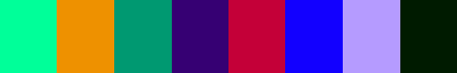
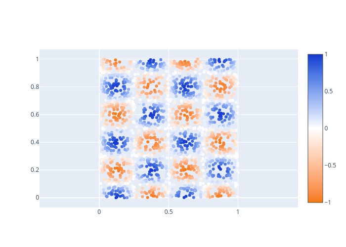

# ethcolor
A basic python package to generate, organize, expand, and optimize accessible color palettes.
This package is aimed at scientific plots, where the differentiability of colors is way more important than the "beauty" of a palette.
The main goal is thus, to have very distinguishable colors for colorblind and non-colorblind people, rather than a pretty combination of (often similar in tone) colors.

## Color Spaces
This package provides the wrapper class `Color` for color specifications, which contains the (numeric/string) representation as well as a declaration of the color space.
The available color spaces are listed in the enum class `COLOR_FORMATS` and include Hex, RGB, HSL, HSV, CIE XYZ, OKLAB, and LMS, each with and without alpha channel.
Using either the `Color.get_value(space)` method or the `convert_color` function, one can easily translate from one color space to the other.
Most functions also accept "raw" inputs such as `RGB(100,50,10)`, which are automatically parsed as follows:

- Format `HEX`: Strings starting with `#` are interpret as hex colors. Strings of length 3 or 6 are considered RGB values and strings of length 4 and 8 are considered RGBA values.
- Formats `RGB_S` and `RGBA_S`: Strings of the type `RGB(..., ..., ...)` and `RGBA(..., ..., ...)` are considered RGB and RGBA values with values ranging from 0 to 255.
- Formats `rgb_S` and `rgba_S`: Strings of the type `rgb(..., ..., ...)` and `rgba(..., ..., ...)` are considered RGB and RGBA values with float values ranging from 0 to 1.
- Formats `RGB` and `RGBA`: Integer numpy arrays of length 3 or 4 are considered RGB and RGBA values with values ranging from 0 to 255.
- Formats `rgb` and `rgba`: Float numpy arrays of length 3 or 4 are considered RGB and RGBA values with float values ranging from 0 to 1.

All other color formats should be instantiated using the `Color` class or calls like `convert_color(np.array([.5,.3,.4]), COLOR_FORMATS.OKLAB, COLOR_FORMATS.rgba)`.

## Palette Management
This package contains the classes `PaletteManager` and `Palette`.
A `Palette` has a name and should contain multiple named colors, provided as a list of lists `[name, color]`.
Internally, all colors are first translated to the floating-point `rgba` space, but the getters allow for arbitrary color spaces.
The `PaletteManager` can contain multiple `Palette`s. The first added `Palette` will be considered the default palette until otherwise specified.
A default `PaletteManager` with a few predefined color palettes can be accessed under the name `default_palettes`.
Aside from defining the color names yourself, you can use `colors_to_palette` to convert a list of `Color`s and a palette name to a `Palette` with automatically generated color names.
The name format of the colors can be specified (e.g. snake case or camel case).
You can also create a copy of a `Palette` with generated names using the `Palette.to_renamed_colors` function.

## Palette Modifications
One of the main goals of this package is to provide an easy way to adapt your color palettes to different types of color blindness.
For that purpose, the function `optimize_palette` can be called, which takes an iterable of colors or a `Palette` object and some optimization parameters and produces a modified palette, which is better differentiable by colorblind (and non-colorblind) people.

To create a new random palette, you can use `random_colors` (which automatically calls `optimize_palette`) and to extend an existing palette, you can use `extend_colors` (which isn't all that good to be honest).

## Interpolating/Viewing/Printing colors
To interpolate between colors, you can either mix two colors with `color_mix` or create a series of interpolated colors with `interpolate_colors`.
Mixing/interpolation by default uses the OKLAB color space, which allows for "perceived" linear blending of colors (see color theory, it's complicated).
Other color spaces for interpolation can be set as an argument.
To create a continuous color gradient over multiple colors, you can use the `interpolate_color_series` function.

To view colors, you can use the `display_palette` function which either takes a list of colors or a `Palette` and displays all the colors in a horizontal bar where each color occupies the same horizontal space.
You can also use the `create_plotly_scale` function to translate your colors/`Palette` into the format of a plotly color scale.

To print colors, you can convert them to the string formats `RGB_S`, `RGBA_S`, `rgb_S`, `rgba_S`, and `HEX` and access their strings by calling `Color.get_value()`.

## Exporting Palettes
The `Palette` class contains the functions `to_latex` and `to_python` to generate blocks of LaTeX or Python code that defines your palette.
This allows for easy interoperability between the two languages, where some plots may be defined in LaTeX using TikZ and some plots may be prerendered with Python.
Both of these functions allow for some customization of the print.

## Examples

Loading the plotly default palette, adding black and white as contrast colors, modifying it for better visibility and displaying the original and the optimized version in the IPython shell:

```python
import ethcolor
palette = ethcolor.default_palettes.get_palette("plotly").ensure_black_and_white()
# Set change_weight to a high value to not move to far away from the original palette
opt_palette = ethcolor.optimize_palette(palette, change_weight=.8)
ethcolor.display_palette(palette)
ethcolor.display_palette(opt_palette)
```

<details>
<summary>Output</summary>


</details><br/>

Exporting a palette to LaTeX code:

```python
import ethcolor
print(ethcolor.default_palettes.get_palette("cblind").to_latex("cb"))
```

<details>
<summary>Output</summary>

```latex
% Palette: cblind
\definecolor{cbblack}{RGB}{0,0,0}
\definecolor{cborange}{RGB}{251,162,0}
\definecolor{cbcyan}{RGB}{0,183,236}
\definecolor{cbgreen}{RGB}{0,161,119}
\definecolor{cbyellow}{RGB}{246,231,55}
\definecolor{cbblue}{RGB}{0,119,184}
\definecolor{cbvermillion}{RGB}{244,100,13}
\definecolor{cbpurple}{RGB}{228,126,173}
```
</details><br/>

Creating a random color palette, automatically detect color names in snake case, adding the palette to the default palette manager, and printing Python code to define the palette in the future without running the optimization:

```python
import ethcolor
import numpy as np
# Seeding of the numpy random generator for reproducible palette generation
np.random.seed(42)
# Setting `white=True` appends white before optimizing, such that all colors
# get pushed away from white. Indexing up to the last element removes white,
# so we do not add it to our palette.
colors = ethcolor.random_colors(8, white=True)[:-1]
palette = ethcolor.colors_to_palette("random", colors, name_format=ethcolor.NAME_FORMATS.SNAKE)
ethcolor.default_palettes.add_palette(palette)
# Displaying the new palette
ethcolor.display_palette(ethcolor.default_palettes.get_palette("random"))
print(ethcolor.default_palettes.get_palette("random").to_python())
```

<details>
<summary>Output</summary>



```python
# Palette: random
palette = ethcolor.Palette("random", [
  ["spring_green", "RGB(0,255,118)"],
  ["yellow_sea", "RGB(255,168,0)"],
  ["observatory", "RGB(0,132,111)"],
  ["christalle", "RGB(48,0,110)"],
  ["torch_red", "RGB(241,0,45)"],
  ["blue", "RGB(57,0,255)"],
  ["dull_lavender", "RGB(182,139,255)"],
  ["deep_fir", "RGB(0,59,0)"],
])
```
</details><br/>

Creating a color gradient and using it as a color scale in a plotly figure:

```python
import ethcolor
import numpy as np
import plotly.graph_objects as go
# Define start, mid, and end color of the color scale
start_color = "RGB(245,120,  4)"
mid_color   = "RGB(255,255,255)"
end_color   = "RGB( 22, 56,209)"
# Get a high resolution interpolation in OKLAB space, rather than plotlys RGB interpolation
interpolated_colors = ethcolor.interpolate_color_series([start_color, mid_color, end_color], 200)
# Create the plotly colorscale
colorscale = ethcolor.create_plotly_scale(interpolated_colors)
# Create a basic scatter dataset
x,y = np.random.sample((2,2000))
z = np.sin(4*np.pi*x) * np.cos(5*np.pi*y)
# Make the plot
go.Figure(
	go.Scatter(
		x=x,
		y=y,
		mode="markers",
		marker_cmin=-1,
		marker_cmax=+1,
		marker_color=z,
		marker_colorscale=colorscale,
		marker_showscale=True,
	),
	layout_yaxis_scaleanchor="x",
).show()
```

<details>
<summary>Output</summary>


</details><br/>

Load an image and update its colors to be more diverse/differentiable.
Displays the palette before and after optimization.
The "before" and "after" image are then plotted side by side.
This example requires the additional python package `Pylette`.

```python
import ethcolor
from scipy.interpolate import RBFInterpolator
import numpy as np
import Pylette
from PIL import Image
from tqdm.auto import tqdm
from IPython.display import display

# Image to load
img_file = "readme_assets/example5.1.png"
# Palette size to extract from the image
palette_size = 8

def vector_interpolation(x,y):
	interp = RBFInterpolator(x,y)
	return lambda c: ethcolor.convert_color(
		interp(
			ethcolor.Color(ethcolor.COLOR_FORMATS.RGB, c)
			.get_value(ethcolor.COLOR_FORMATS.OKLAB)[None]
		)[0],
		ethcolor.COLOR_FORMATS.OKLAB,
		ethcolor.COLOR_FORMATS.RGB,
	).get_value()

# Extract the "fundamental" color palette of the image with Pylette
palette1 = [
	ethcolor.convert_color(c.rgb)
	for c in Pylette.extract_colors(img_file, palette_size=palette_size).colors
]
# Display the palette before optimization
ethcolor.display_palette(palette1)
# Create an improved palette (high change_weight to not diverge from the original colors too much)
palette2 = ethcolor.optimize_palette(palette1, change_weight=.95, out_format=ethcolor.COLOR_FORMATS.rgba)
# Display the palette after optimization
ethcolor.display_palette(palette2)
# Extend the palettes before and after optimization
# with the corners of the RGB color cube to ensure
# that our interpolating projection does not extend
# beyond the viable color space.
boundary_colors = [
	ethcolor.convert_color(f"rgb({r},{g},{b})")
	for r in [0,1] for g in [0,1] for b in [0,1]
]
palette1 += boundary_colors
palette2 += boundary_colors
# Create an interpolation function between both palettes using scipy
color_map = vector_interpolation(
	np.array([c.get_value(ethcolor.COLOR_FORMATS.OKLAB) for c in palette1]),
	np.array([c.get_value(ethcolor.COLOR_FORMATS.OKLAB) for c in palette2]),
)
# Load the image with pillow and extract the RGB values
img = Image.open(img_file)
img_arr = np.array(img)
# Create a modified copy of the image using our interpolation function
# between the original and the optimized colors
new_img_arr = np.zeros_like(img_arr)
for x in tqdm(range(img_arr.shape[0])):
	for y in range(img_arr.shape[1]):
		new_img_arr[x,y] = color_map(img_arr[x,y])
new_img_arr = np.clip(new_img_arr, 0, 255)
# Display both images side by side in the IPython shell
display(Image.fromarray(np.concatenate([img_arr,new_img_arr],axis=1)))
```

<details>
<summary>Output</summary>


</details><br/>

## Open Issues

The colorblindness simulation code is still a bit work-in-progress.
It works, but gives somewhat different results than reference implementations, so that has to be verified.
